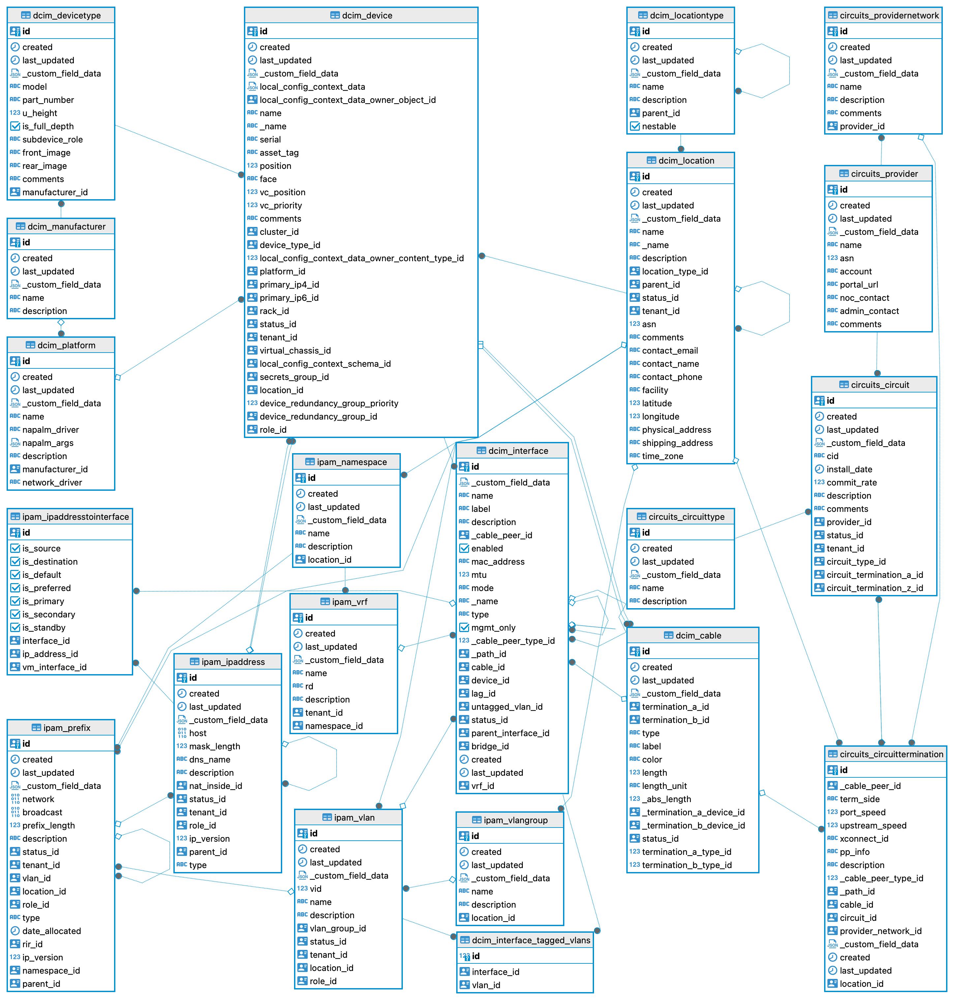

# Introduction

Understanding the data model is key to effectively navigating Nautobot. The number of models in Nautobot Core alone is nearly 200 models which does not include any of the models that come from Nautobot apps. This introduction does not attempt to document all of models, but instead intends to highlight the most common models to be used as a quick reference.

## Fundamental Model Simplified

The models included are generally the most used models and the most used attributes of those models, with the following points of consideration:

- Tenants are an often used model, however they connect to most models and in the interest of simplicity not included.
- The direction of relationship is not included, however you can generally tell if there is an `<model>_id` attribute, such as `device_id` on the Interface model.
- Further details can be understood from the UML style diagram, that is roughly in the same layout.
- This is a model view, not a table view, most noticeably that means "through" tables are not shown as they would in a UML diagram.

## Fundamental Model UML

The models included in the UML are largely the same as the simplified shown previously. This diagram was generated with postgres on [DBeaver](https://dbeaver.io/) and uses the [IDEF1X](https://en.wikipedia.org/wiki/IDEF1X) notation.

